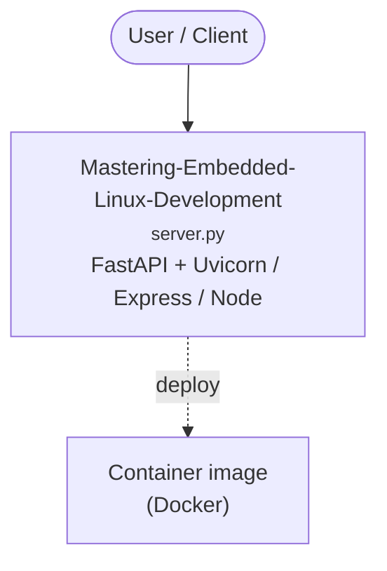

# Context Map — `Mastering-Embedded-Linux-Development`

> Auto-generated architecture & deployment context map. Summarizes the core application, container/cloud footprint, and database connections. Regenerate after significant structural changes.

**Repo:** `avnit/Mastering-Embedded-Linux-Development` · **Fork** · Public · Primary language: C · Default branch: `main` · Files: 126

**Description:** Mastering Embedded Linux Development Fourth Edition, published by Packt

## 1. Core application

Mastering Embedded Linux Development – Fourth Edition

- **Frameworks / runtime:** FastAPI + Uvicorn, Gunicorn, Express / Node
- **Entry points:** `Chapter17/zeromq/server.py`
- **Listens on port(s):** 1117, 1121, 1122, 1404, 1408, 1409

## 2. Containers & cloud applications

**Containers:**
- `Chapter16/gattd/Dockerfile`

## 3. Database connections

_No database drivers or connection strings detected._

## 4. Architecture diagram

## 5. Security posture

- No open Dependabot alerts or static-scan findings recorded.

---
_Generated by repo context-mapping pass on 2026-08-13._